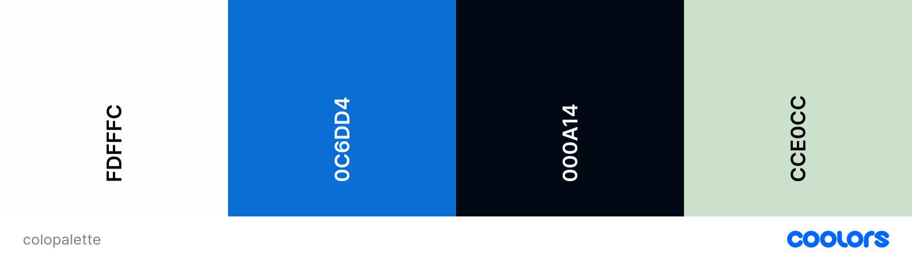
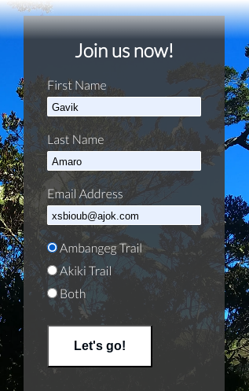

# Mt. Pulag Hikers

Mt. Pulag Hikers website is created purposely for interested hikers to join in on the hikes to Mt. Pulag. It is designed to be responsive allowing users to view the site on a range of devices. It will also provide information about the organization.

View Mt. Pulag Hikers on [GitHub Pages](https://github.com/keelam13/mt-pulag-hikers/deployments)
---

## CONTENTS

* [User Experience](#user-experience-ux)
  * [User Stories](#user-stories)

* [Design](#design)
  * [Colour Scheme](#colour-scheme)
  * [Typography](#typography)
  * [Imagery](#imagery)

  * [Wireframes](#wireframes)

* [Features](#features)
  * [General Features on Each Page](#general-features-on-each-page)
  * [Future Implementations](#future-implementations)
  * [Accessibility](#accessibility)

* [Technologies Used](#technologies-used)
  * [Languages Used](#languages-used)
  * [Other Technologies used](#other-technologies-used)

* [Deployment & Local Development](#deployment--local-development)
  * [Deployment](#deployment)
  * [Local Development](#local-development)
    * [How to Fork](#how-to-fork)
    * [How to Clone](#how-to-clone)

* [Testing](#testing)

* [Credits](#credits)
  * [Code Used](#code-used)
  * [Content](#content)
  * [Media](#media)
  * [Acknowledgments](#acknowledgments)

---

## User Experience (UX)

### Initial Discussion
Mt. Pulag Hikers is a small group of hikers who regularly hike up the 3rd highest mountain in the Philippines, and are constantly looking for like minded individuals who want to join them on the hikes. Members are a mix of beginners and experienced hikers who learn from each other through the hikes. 

Through the help of social media, Mt. Pulag is getting noticed by avid hikers and non-hikers because of its pristine beauty. Dubbed as The playground of the gods, a lot of tourists are eager to conquer Mt. Pulag and experience what it has to offer.

#### Key information for the site
* What are the requirements in climbing Mt. Pulag.
* What are the available trails to take and their level of difficulty.
* How to join the group.
* How to contact the group.
* What to look forward to / updates.

### User Stories

#### Client Goals
* To have the accessibility to view the site on a range of device screens.
* To make it easy for potential joiners to know what Mt. Pulag Hikers is about, and how to join in on the hikes.
* To have a glimpse of what they could experience and see during the hikes. 
* To allow users to easily contact Mt. Pulag Hikers for any concerns.

#### First Time Visitor Goals
* I want to easily navigate through the website to find what I’m looking for.
* I want to know the purpose of Mt. Pulag Hikers and how to take part in it.
* I want to have an idea on what to expect to better prepare when joining.
* I want to be able to see their social media.

#### Returning Visitor Goals
* I want to find up to date information regarding scheduled hikes and be able to join a new one.
* I want to be able to easily contact Mt. Pulag hikers for questions I might have.

#### Frequent Visitor Goals
* I want to find new options in climbing Mt. Pulag.

## Design

### Colour Scheme

The website uses the scheme to go with the colors of nature in the photography. Jocular green was used as a background color to stay true to the color of nature, and wizard blue as the clear skies as hover effect color on the input fields and submit button, and as response color on the buttons. The color palette was generated through the Coolors website.

### Typography

Fonts used for this site were imported from [Google Fonts](https://fonts.google.com/).
* Lato Google font was used as the primary font for the site for content readability.

  

* Lobster Google font was used as the logo font for it to standout.

  

* Abel Google font was also used only for the cover text to give a slight emphasis on the text. 

  
  
### Imagery

Photos of the trails, camp sites, and views from the trails and atop the summit were used in the website. Some of these photos are personal collections and some are taken from other hikers/photographers on the web, which I included in the [Credits](#credits) section.

### Wireframes

Wireframes are created for all the page sections using Balsamiq.

#### Mobile devices
* Home Page

* Response Page

#### Tablets
* Home Page

* Response Page

#### Desktop
* Home Page

* Response Page

## Features

### General features

The website only has a single page which is divided into three sections, which are accessible from the navigation menu (About us, Trails and Join us sections). A second page is also added as a response page which is shown once a user correctly fills out and submits the form on the Join Us section.

#### Navigation Bar

The main page has a responsive navigation bar at the top which allows the user to navigate through the site. To the left of the navigation bar is the name of the hikers' group and to the right of the navigation bar are the links to the sections in the page (About us, Trails and Join us). 

When viewing with mobile devices the navigation links change to a burger toggler. This was implemented to give the site a clean look and to promote a good user experience, as users are used to seeing the burger icon when on mobile devices to navigate a site.

Once the burger menu is clicked, a dropdown menu will appear with the links.

The response page, however, has a different navigation bar. instead of the three sections on the menu, a link Back to Home page is on the right side. It is another option for users to click, if the page is not automatically redirected back to the home page after 10 seconds.  

On mobile devices, the dropdown menu only contains the link Back to Home page.

#### Hero Section

This section has a fixed background image which show a view of Mt. Pulag where the group climbs on a regular basis. It also contains a cover text with the tag Mt. Pulag is known for and the address.

* Hero section view on larger screens

* Hero section view on mobile devices

#### Footer

Both pages have a footer which contains a qoute from Edmund Hillary and social media icon links to facebook, instagram, youtube and tiktok. Icons were used to keep the footer clean and because they are universally recognisable. For users to be able to contact Mt. Pulag hikers, mobile phone numbers and email address are also shown alongside the social media icons. Icons are also animated on hover.

* Footer view on larger screens

* Footer view on mobile devices

### About us

The section is further broken down into subsectioned, which gives the user information about the group, what potential joiners should prepare, and the gallery which may attract users in joining. The images in the gallery are stacked horizontally which users can scroll to view.

* About us section view on larger devices

* About us section view on mobile devices

### Popular trails

This sections give the user information on popular trails when climbing Mt. Pulag. It contaions the name of the trail, difficulty, where the jump-off point is and for whom is it ideal for. It also contains a picture of the trail for the user to have an idea what to expect. A subsection is also higlighted with a blinking text and border to cath the attention of the user on a soon to open post.

* Popular trails section view on larger screens

* Popular trails section view on mobile devices

### Join Us

This section gives the user the opportunity to establish contact with, and to join the group. It has a form where users can enter their names and Email address for the group to get back to them. From the same form, users can also choose already which trail they prefer to take by clicking on a button. All inputs are also set as required so the fields must be filled out properly before submitting. The text input field is animated for largers screens when the pointer hovers over it. The submit button is also animated on hover. Once the submit button is clicked, it will lead to the response page.

* Join us section view on larger screens

* Join us section view on mobile devices

### Response page

A message welcoming the user to the team after submitting the form and lets them know someone will reach out to them within 24 hours. It also says that the user may now prepare for the climb. The page is set to be redirected to the home page in 10 seconds or users may click on the here link, or Back to home page on the navigation bar to go back to the home page.

* Response page view on larger screens

* Response page view on mobile devices

### Future Implementations

* Add some maps for the popular trails.
* Add link to the email address.
* Use images with better resolutions.
* Improve quaity of commit messages and commit every after bit of changes.
* Work on the website performances on mobile devices and desktops.
* Proper use of the flex box.

### Accessibility

I have been mindful during coding to ensure that the website is as accessible friendly as possible. I have achieved this by:

1. Using semantic HTML.
2. Using descriptive alt attributes on images on the site.
3. Providing information for screen readers where there are icons used and no text - e.g. social networks.
4. Ensuring that there is a sufficient colour contrast throughout the site.
5. Ensuring menus are accessible by fixing it on top of the screen.

## Technologies Used

### Languages Used

HTML and CSS were used to create this website.

### Other Technologies used

* [Balsamiq](https://balsamiq.com/) - Used to create wireframes.
* [Git](https://git-scm.com/) - For version control.
* [Github](https://github.com/) - To save and store the files for the website.
* [Google Fonts](https://fonts.google.com/) - To import the fonts used on the website.
* [Font Awesome](https://fontawesome.com/) - For the iconography on the website.
* [Google Dev Tools](https://developer.chrome.com/docs/devtools) - To troubleshoot and test features, solve issues with responsiveness and styling.
* [Tiny PNG](https://tinify.com/web/convert) To compress images.
* [Birme](https://www.birme.net/?target_width=500&target_height=300&no_resize=true&image_format=webp) To resize images and change to webp format.
* [Favicon.io](https://favicon.io/) To create favicon.
* [Am I Responsive?](https://ui.dev/amiresponsive) To show the website image on a range of devices.
* [Coolors](https://coolors.co/) was used to create the color palette.
* [EzGif](https://ezgif.com) was used to resize GIF images.

## Deployment & Local Development

### Deployment

The site is deployed using GitHub Pages - Mt. Pulag Hikers

To Deploy the site using GitHub Pages:
1. Login (or signup) to Github.
2. Go to the repository for this project, keelam13/mt-pulag-hikers
3. Click the settings button.
4. Select pages in the left hand navigation menu.
5. From the source dropdown select main branch and press save.
6. The site has now been deployed, please note that this process may take a few minutes before the site goes live.

The live link can be found [here](https://keelam13.github.io/mt-pulag-hikers/).

### Local Development

#### How to Fork

To fork the Mt. Pulag Hikers repository:

1. Log in (or sign up) to Github.
2. Go to the repository for this project, keelam13/mt-pulag-hikers.
3. Click the Fork button in the top right corner.

#### How to Clone

To clone the Mt. Pulag Hikers repository:

1. Log in (or sign up) to GitHub.
2. Go to the repository for this project, keelam13/mt-pulag-hikers.
3. Click on the code button, select whether you would like to clone with HTTPS, SSH or GitHub CLI and copy the link shown.
4. Open the terminal in your code editor and change the current working directory to the location you want to use for the cloned directory.
5. Type 'git clone' into the terminal and then paste the link you copied in step 3. Press enter.

## Testing

Please refer to the [TESTING.md](TESTING.md) file for all test-related documentation.

## Credits

### Code Used

* [Image gallery with horizontal scroll](https://www.w3schools.com/howto/howto_css_image_gallery_scroll.asp)
* [Fading image](https://www.shecodes.io/athena/24883-how-to-create-a-fading-image-using-css)
* [Blink animation](https://jsfiddle.net/umz8t/6490/https://stackoverflow.com/questions/51764992/blink-border-3-times-1-second-per-loop-in-css)
* [Refresh page metadata](https://github.com/IuliiaKonovalova/animal_shelter/blob/main/response.html)

### Content

The inspiration for the content came from the increasing number of hikers and tourists alike who want to climb Mt. Pulag.  

###  Media

Some of the images images used on the website are personal collection, and the other were taken from different bloggers who went to Mt. Pulag.

* [Akiki trail](https://jamieinhernook.wordpress.com/wp-content/uploads/2016/12/2016-12-15-09-27-09.jpg);
* [Akiki trail2](http://www.pinoymountaineer.com/2022/06/hiking-matters-701-my-third-akiki-ambangeg-dayhike-of-mt-pulag.html)
* [Ambangeg trail, Eddet river](https://jedtravelsblog.wordpress.com/2017/12/14/mt-pulag-2017/)
* [Ambangeg trail2](https://tinamariejoy.blogspot.com/2016/06/our-freezing-quest-to-witness-mount.html)
* [Galaxy](https://www.aaronpalabyab.com/blog/2016/10/21/mt-pulag-akiki-trail-astrophotography)
* [Mt. Pulag camp1](https://www.rappler.com/philippines/201044-mount-pulag-reopens-hikers-trekkers/)
* [Mt. Pulag camp2](https://www.meloy.co/2013/03/camping-at-mount-pulag-ambangag-trail-slow-trekking-with-anywhere-philippines.html)
* [Mt. Pulag cotton clouds, Mt. Pulag camp3](https://gypsettingfreespirit.wordpress.com/tag/mount-pulag/)
* [Mt. Pulag freedom](https://pnmsadventures.weebly.com/mt-pulag-traverse.html)
* [Mt. Pulag grassland](https://peakd.com/hive-194913/@ybanezkim26/mt-pulag-the-playground-of-the-gods-part-2)
* [Mt. Pulag sunrise, Mt. Pulag grassland2, Mt. Pulag sun](https://loneprowler.com/2015/04/09/mt-pulag/)

* [Mt. Pulag summit](https://hiketomountains.com/wp-content/uploads/2021/12/Mt-Pulag-4-768x560.jpg)
* [Mt. Pulag milkyway](https://www.flickr.com/photos/jianphotography/8578765930)

* [Sea of cloud hiker](https://dakilanglaagan.com/2017/09/18/mt-pulag-what-the-playground-of-gods-taught-us-about-taking-things-slowly-via-akiki-trail/)
* [Tawangan trail](https://thirdworldtrekker.wordpress.com/2017/02/07/mt-pulag-via-tawangan/)

  
###  Acknowledgments

- The Almighty for the opportunity to do coding.
- My family for their unending support.
- My other half for the love and understanding.
- Cici my girl for the inspiration.
- [Iuliia Konovalova](https://github.com/IuliiaKonovalova) my mentor for the advice, tips and guiding me through the project.
- [Kera Cudmore](https://github.com/kera-cudmore) for the great help on constructing a README file.
- [Code Institute](https://codeinstitute.net/) lessons, tutors and Slack community members for their support and help.
- [Kevin Powell](https://www.youtube.com/user/KepowOb) for his amazing CSS tutorials.
