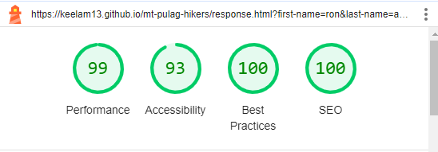

# TESTING

## Compatibility

The webpage was built using Chrome browser, but in order to confirm the correct functionality, responsiveness, and appearance:

+ The website was also tested on the following browsers: Edge, Firefox, Brave.

    - Chrome:

    

    - FireFox

    

    - Brave:

    

## Responsiveness

Aside from testing the website of its responsiveness using the dev tools, the [Am I responsive?](https://ui.dev/amiresponsive) was also used to check how the website respond on different screen sizes.

## Manual testing

+ The functionality of the links in the website was checked as well by different users.

| feature | action | expected result | tested | passed | comments |
| --- | --- | --- | --- | --- | --- |
| Navbar | | | | | |
| About us | Click on the "About us" link | The user is redirected to the About us section | Yes | Yes | - |
| Trails | Click on the "Trails" link | The user is redirected to the Popular Trails section | Yes | Yes | - |
| Join us! | Click on the "Join us!" link | The user is redirected to the Join us form section | Yes | Yes | - |
| Footer | | | | | |
| Facebook icon in the footer | Click on the Facebook icon | The user is redirected to the Facebook page | Yes | Yes | - |
| Instagram icon in the footer | Click on the Instagram icon | The user is redirected to the Instagram page | Yes | Yes | - |
| YouTube icon in the footer | Click on the YouTube icon | The user is redirected to the YouTube page | Yes | Yes | - |
| Tiktok icon in the footer | Click on the Tiktok icon | The user is redirected to the Tiktok page | Yes | Yes | - |
| Join us form section | | | | | |
| First name input | Enter the first name | The first name is entered | Yes | Yes | If user doesn't enter the first name, the error message appears |
| Last name input | Enter the last name | The last name is entered | Yes | Yes | If user doesn't enter the last name, the error message appears |
| Email input | Enter the email | The email is entered | Yes | Yes | If user doesn't enter the email, the error message appears. If user enters not valid email, the error message appears |
| Trail preference tick button | Click on the button | The button is checked | Yes | Yes | These buttons are not required as the user may opt to choose trail preference at a later time and/or user may have other reasons for contacting |
| "Let's go!" button | Click on the "Let's go!" button | The user is redirected to the response page | Yes | Yes | - |
| Response page | | | | | |
| Response message | The user will be automatically redirected to the home page after 10 seconds | The user is redirected to the home page | Yes | Yes | - |
| Back to home page | Click the "Back to home page" link | The user is redirected to the home page | Yes | Yes | - |

---
## Validator testing
+ ### HTML
  #### Home Page
    - No errors or warnings were found when passing through the official W3C validator.

    

  #### Response Page
    - No errors or warnings were found when passing through the official W3C validator.

    
    
+ ### CSS
  No errors or warning were found when passing through the official W3C (Jigsaw) validator:
    
    

+ ## LightHouse report

    - Using lighthouse in devtools, the performance, the accessibility and the readability of the website were checked.
    
  ### Home page

    - Home page on desktop 

  

    - Home page on mobile

  

  ### Response page

    - Response page on desktop

  

    - Response page on mobile

  

---
​
## Bugs

+ ### Solved bugs

    1. The line spacing of the content was to narrow and looks crowded. 
    
        *Solution:* Line-height was increased to 1.5px.
    
    2. The color of the Let's go! button was distracting.
        
        *Solution:* The color was changed to back white background with black texts, which changes to blue background with white texts on hover.

    3. The whole page had a width overflow.
        
        *Solution:* Min-width of the body element was changed to 100vh.
    ---
+ ### Unsolved bugs

    - The padding or the spacing changes with Firefox browser.

+ ### Mistakes
    - Uploading low resolution images.
    - When using flex box, the container element was not set to flex first before the styling content.

---